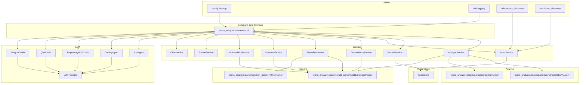

# Project Flow Diagram

```mermaid
flowchart TD
    %% Packages
    subgraph CLI [Command Line Interface]
        CLI_APP["mana_analyzer.commands.cli"]
    end

    subgraph ANALYSIS [Analysis]
        ANALYZER["mana_analyzer.analysis.checks.PythonStaticAnalyzer"]
        CHUNKER["mana_analyzer.analysis.chunker.CodeChunker"]
    end

    subgraph PARSERS [Parsers]
        MULTI_PARSER["mana_analyzer.parsers.multi_parser.MultiLanguageParser"]
        PYTHON_PARSER["mana_analyzer.parsers.python_parser.PythonParser"]
    end

    subgraph SERVICES [Services]
        ANALYZE_SVC["AnalyzeService"]
        SEARCH_SVC["SearchService"]
        INDEX_SVC["IndexService"]
        DEPENDENCY_SVC["DependencyService"]
        DESCRIBE_SVC["DescribeService"]
        STRUCTURE_SVC["StructureService"]
        VULN_SVC["VulnerabilityService"]
        REPORT_SVC["ReportService"]
        CHAT_SVC["ChatService"]
    end

    subgraph LLM [LLM]
        ASK_AGENT["AskAgent"]
        CODING_AGENT["CodingAgent"]
        REPO_CHAIN["RepositoryMultiChain"]
        QNA_CHAIN["QnAChain"]
        ANALYZE_CHAIN["AnalyzeChain"]
        PROMPTS["LLM Prompts"]
    end

    subgraph UTILS [Utilities]
        SETTINGS["config.Settings"]
        LOGGING["utils.logging"]
        DISCOVERY["utils.project_discovery"]
        INDEX_DISC["utils.index_discovery"]
    end

    subgraph VECTOR [Vector Store]
        FAISS["FaissStore"]
    end

    %% Relationships
    CLI_APP --> ANALYZE_SVC
    CLI_APP --> SEARCH_SVC
    CLI_APP --> INDEX_SVC
    CLI_APP --> DEPENDENCY_SVC
    CLI_APP --> DESCRIBE_SVC
    CLI_APP --> STRUCTURE_SVC
    CLI_APP --> VULN_SVC
    CLI_APP --> REPORT_SVC
    CLI_APP --> CHAT_SVC
    CLI_APP --> ASK_AGENT
    CLI_APP --> CODING_AGENT
    CLI_APP --> REPO_CHAIN
    CLI_APP --> QNA_CHAIN
    CLI_APP --> ANALYZE_CHAIN

    ANALYZE_SVC --> ANALYZER
    ANALYZE_SVC --> CHUNKER
    ANALYZE_SVC --> MULTI_PARSER
    SEARCH_SVC --> FAISS
    INDEX_SVC --> FAISS
    DEPENDENCY_SVC --> MULTI_PARSER
    DESCRIBE_SVC --> MULTI_PARSER
    DESCRIBE_SVC --> PYTHON_PARSER
    STRUCTURE_SVC --> MULTI_PARSER
    VULN_SVC --> MULTI_PARSER

    ASK_AGENT --> PROMPTS
    CODING_AGENT --> PROMPTS
    REPO_CHAIN --> PROMPTS
    QNA_CHAIN --> PROMPTS
    ANALYZE_CHAIN --> PROMPTS

    SETTINGS --> CLI_APP
    LOGGING --> CLI_APP
    DISCOVERY --> INDEX_SVC
    INDEX_DISC --> INDEX_SVC
```
