# mana-analyzer

**Installable Python CLI AI code analyzer for multi‑language repositories**

---

## Table of Contents
1. [Overview](#overview)
2. [Features](#features)
3. [Installation](#installation)
4. [Quick-Start Guide](#quick-start-guide)
5. [Configuration & Environment Variables](#configuration--environment-variables)
6. [Command-Line Interface (CLI) Reference](#command-line-interface-cli-reference)
7. [CLI Workflows & Diagrams](#cli-workflows--diagrams)
8. [Tooling & Integrations](#tooling--integrations)
9. [FAQ & Troubleshooting](#faq--troubleshooting)
10. [Coding Flows & Debugging](#coding-flows--debugging)
11. [Architecture Overview](#architecture-overview)
12. [Development & Testing](#development--testing)
13. [Contributing](#contributing)
14. [License](#license)
15. [Contact & Support](#contact--support)

---

## Overview

`mana-analyzer` is a **tool-aware, LLM-augmented code analysis suite** that can:
- Incrementally index source code of many languages (Python, JavaScript/TypeScript, Dart, JVM languages, C/C++, Bash, PowerShell, HTML/Markdown, etc.).
- Perform static quality checks (unused imports, missing doc-strings, deep nesting, cyclomatic complexity, security-related patterns, …) in parallel using a process pool.
- Store vector embeddings in a local FAISS index and provide **semantic search** over the whole repository.
- Answer natural-language questions with Retrieval-Augmented Generation (RAG) while citing exact source lines.
- Generate dependency graphs (JSON/DOT/GraphML) and run optional security scans.
- Offer an interactive REPL (`chat`) that can invoke *tool-aware agents* for multi-step reasoning, including a **coding agent** capable of generating patches.

The project is deliberately modular: the CLI, core services, LLM wrappers, parsers, tool workers, and vector-store back-ends live in separate packages under `src/mana_analyzer/`. This layered design makes it easy to replace the LLM provider, swap the vector store, add new language parsers, or extend the agent tooling without touching the CLI itself. The service layer exposes reusable classes such as the indexing/searching pipelines, the `AskAgent`, and `CodingAgent`, all wired together in `src/mana_analyzer/commands/cli.py`.

---

## Features

- **Incremental indexing** – only newly added or modified files are re-embedded, reducing compute cost.
- **Multi-language support** – parsers for Python, JS/TS, Dart, JVM, native C/C++, Bash, PowerShell, HTML/Markdown, etc.
- **Static analysis suite** – unused imports, wildcard imports, missing doc-strings, deep nesting, cyclomatic complexity, security patterns, and more.
- **Semantic search** – fast FAISS-backed similarity lookup with configurable distance metric.
- **RAG `ask` command** – retrieve relevant chunks, construct prompts, call LLM, and return answers with line citations.
- **Dependency graph generation** – directed graphs of import relationships; export formats: JSON, DOT, GraphML.
- **Security scanning** – integrates `safety` vulnerability database and `pip list --outdated`.
- **Chat REPL** – stateful conversation with the `AskService`; optional *agent-tools* mode enables tool-calling.
- **Coding agent** – a helper that can generate code, apply patches, and iteratively improve solutions.
- **Configurable logging** – per-run logs, LLM call logs, and optional JSONL for downstream analysis.
- **Extensible architecture** – plug-in new parsers, replace FAISS with another vector store, or switch LLM back-ends (OpenAI, Azure, local LM, etc.).
- **GitHub code search tool** – introduces a `github_code_search` LangChain tool that wraps the GitHub code search API. The tool provides normalized payloads with `ok`, `results`, and `error` fields, respects `GITHUB_TOKEN`, and gracefully reports rate limits and other failures.

---

### Feature Spotlight

#### Incremental indexing keeps every run fast
Only changed or new files are re-embedded, which lets you refresh large repositories without reprocessing everything. The pipeline still walks the tree with language-aware chunkers and hands the resulting vectors to FAISS through the shared index service.

#### Tool-aware agents keep reasoning grounded
`AskAgent` and the coding agent integrate lan-chain tools so their answers always cite real files and line ranges. Logs contain tool traces, decisions, and warnings, giving you a transparent audit trail of every suggestion.

#### Semantic search plus structured reporting
FAISS-backed similarity search pairs with the static analyzer suite, dependency reports, and optional LLM describe operations so you get both precise hits and human-friendly summaries. Exportable Markdown and JSON reports make it easy to surface findings in CI or architecture reviews.

#### Security, logging, and observability coverage
Safety checks, `pip list --outdated`, and the `security-scan` command share the same orchestrator, so compliance is just another option flag. `LlmRunLogger` records chat turns under `.mana_llm_logs` so you can replay tool steps without rerunning a session.


## Installation

```bash
# 1️⃣ Create an isolated virtual environment
python3.10 -m venv .venv
source .venv/bin/activate

# 2️⃣ Upgrade pip and install the package in editable mode
pip install --upgrade pip
pip install -e .[dev]
```

The package declares the following optional extras:
- `dev` – testing, linting, and additional development tools.
- `faiss-gpu` – GPU-accelerated FAISS (requires CUDA).
- `security` – `safety` for vulnerability scanning.

Contributor references:

- Optional dependency compatibility/install matrix: [`docs/optional-deps.md`](docs/optional-deps.md)
- Debugging notes (including chat-memory schema and flow rules): [`docs/debugging.md`](docs/debugging.md)

Make sure you have an OpenAI-compatible API key available, e.g.:
```bash
export OPENAI_API_KEY="sk-…"
# Optional: point to a self-hosted endpoint
export OPENAI_BASE_URL="https://api.openai.com/v1"
```

---

## Quick-Start Guide

```bash
# Index a repository (creates a FAISS index under ~/.cache/mana_analyzer)
mana-analyzer index /path/to/your/project

# Perform a semantic search
mana-analyzer search "how does pagination work"

# Ask a natural-language question (RAG)
mana-analyzer ask "What are the security risks in the authentication module?"

# Start an interactive chat session
mana-analyzer chat
```

All commands accept a `--verbose` flag for more detailed output and a `--config` flag to point to a custom `settings.toml`.

---

## Configuration & Environment Variables

`mana-analyzer` relies on `pydantic-settings`, so you can override values via shell exports, `settings.toml`, or a `.env` file. Key settings live in `src/mana_analyzer/config/settings.py` and expose sensible defaults that make OpenAI-compatible runs breeze.

| Variable | Default | Purpose |
| --- | --- | --- |
| `OPENAI_API_KEY` | *required* | API key consumed by both chat and repair flows. |
| `OPENAI_BASE_URL` | `None` | Optional custom endpoint for Azure, LangChain, or self-hosted models. |
| `OPENAI_CHAT_MODEL` | `gpt-4.1-mini` | Default chat model for `ask` and `chat`. |
| `OPENAI_EMBED_MODEL` | `text-embedding-3-small` | Embedding model used by FAISS and search. |
| `DEFAULT_TOP_K` | `8` | Search depth when `--k` is omitted. |
| `CODING_FLOW_MAX_TURNS` | `5` | Max saved turns when `--coding-memory` is enabled. |
| `CODING_FLOW_MAX_TASKS` | `20` | Max open tasks tracked in each flow. |
| `CODING_PLAN_MAX_STEPS` | `8` | Default planning budget for the coding agent. |
| `CODING_SEARCH_BUDGET` | `4` | Default semantic search budget per plan. |
| `CODING_READ_BUDGET` | `6` | Default `read_file` call budget per coding turn. In `--execution-profile full-auto`, this is the dynamic upper cap selected by the LLM each turn. |
| `CODING_REQUIRE_READ_FILES` | `2` | Minimum required read files before edits. |

Drop a `settings.toml` into your project root to pin extra options such as `index_dir`, logging detail, or tool-worker orchestration. Optional extras and compatibility guidance live in [`docs/optional-deps.md`](docs/optional-deps.md), which helps you evaluate GPU FAISS, security tooling, and other enhancers before rolling them into production.


## Command-Line Interface (CLI) Reference

| Command | Description |
|---------|-------------|
| `index <path>` | Walks the given directory, parses files, creates embedding chunks, and stores them in a FAISS index. |
| `search <query>` | Performs semantic similarity search against the local index and prints the top matches with file/line context. |
| `ask <question>` | Retrieval-augmented generation: fetches relevant chunks, builds a prompt, calls the LLM, and returns an answer with citations. |
| `chat` | Starts a REPL where you can ask multiple questions; the session retains context and can invoke tool-aware agents. |
| `flow <path>` | Prints coding-flow memory summary (objective, checklist, open tasks, decisions, changed files); supports `--flow-id` and `--format json`. |
| `profile` | Runs the indexing pipeline with `cProfile` and writes a performance report to `profile.txt`. |
| `lint` | Executes the static analysis checks and prints a summary of warnings/errors. |
| `dependency-graph` | Generates a dependency graph of the indexed project; use `--format dot|graphml|json`. |
| `security-scan` | Runs `safety` against the project's dependencies and reports known vulnerabilities. |

### `index` — build or refresh an index
`mana-analyzer index` walks the requested path, uses language-aware chunkers, and writes vectors into the resolved index directory (default: `~/.cache/mana_analyzer`). Pass `--rebuild` to ignore timestamps and force a full re-embedding, `--ephemeral-index` to stage a temporary store that is deleted once the command completes, and `--json` to serialize the summary for automation.

All commands share common options:
- `--index-dir <dir>` – location of the FAISS index (default: `~/.cache/mana_analyzer`).
- `--log-level <LEVEL>` – Python logging level (`DEBUG`, `INFO`, `WARNING`, …).
- `--max-workers <N>` – number of parallel workers for indexing (defaults to the number of CPU cores).

---

## Tooling & Integrations

### Tool-aware agents and workers

- The REPL session hosts *tool-aware agents* that call LangChain `StructuredTool`s for internet search, repository search, or GitHub search. Each tool is registered through `src/mana_analyzer/tools/__init__.py`, so new tooling becomes available to every agent automatically.
- Background workers (`src/mana_analyzer/llm/tool_worker_process.py`) manage LLM calls and tool executions. They expose a lightweight payload protocol defined by the `WorkerInitPayload`, `ToolRunRequest`, and `ToolRunResponse` dataclasses, which also power the coding agent's patch submission workflow.

### Tools manager orchestration (planner + execution)

- `ToolsManagerOrchestrator` (`src/mana_analyzer/llm/tools_manager.py`) runs planner-driven multi-pass execution for coding sessions.
- The **Head Tools Planner** prompt (`HEAD_TOOLS_PLANNER_PROMPT`) decides objective, steps, current step, and terminal decision (`continue|revise|finalize|stop`).
- The **ToolsManager** prompt (`TOOLSMANAGER_PROMPT`) compiles those steps into 1..N worker-executable tool requests with optional per-request tool-policy overrides.
- Auto-execute pass logs record planner decision, batch reason, request fingerprints, tool steps, warnings delta, and terminal reason for transparent debugging.
- Full-auto pass-cap behavior:
  - `pass_cap_reached` is treated as a resumable checkpoint, not a terminal user-facing stop.
  - The chat loop auto-resumes same-turn execution until completion or a hard blocker (for example, permissions/credentials/tool-worker failures).
  - `--full-auto-status-every N` emits compact checkpoint summaries every `N` **auto-execute passes** (not chat turns), summarizing decisions + checklist counts since the previous checkpoint.
  - Full-auto also enables LLM-driven dynamic read policy per turn:
    - `read_budget` is selected each turn and clamped to `1..min(--coding-read-budget, 60)`.
    - `read_file` line windows are policy-driven and clamped to `200..2000` lines per call.
- Runtime execution backend is configurable:
  - `local` (default): executes per-pass requests through the existing worker client path.
  - `redis` (opt-in): enqueues per-pass requests to Redis/RQ workers for concurrent multi-process execution.
- Redis runtime state keys are ephemeral and expire automatically (default 24h TTL); historical `.mana_llm_logs` JSONL files are not backfilled into Redis.

Redis backend prerequisites (system-managed service):

```bash
# Start at least one Redis/RQ worker in a separate shell
rq worker mana-tools --url redis://127.0.0.1:6379/0

# Run chat with Redis execution enabled
mana-analyzer chat \
  --agent-tools \
  --coding-agent \
  --tool-exec-backend redis \
  --redis-url redis://127.0.0.1:6379/0 \
  --redis-queue-name mana-tools \
  --toolsmanager-parallel-requests 3 \
  --redis-ttl-seconds 86400
```

If Redis/RQ is unavailable at runtime, the CLI falls back to the local executor and emits a warning.

### Tool-first mutation model and patch format

- Coding execution is tool-first: inspect/search first, then edit, then verify. Primary mutation path is `apply_patch`; fallback is `write_file`.
- Repository mutation tools: `apply_patch`, `write_file`.
- Repository execution/inspection tools: `read_file`, `semantic_search`, `run_command`.
- Patch format requirement for `apply_patch`: use git-unified diff (`diff --git`, `---`, `+++`, `@@` hunks). Non-git patch wrappers are intentionally rejected in tool policy and prompts.
- Language-aware tooling matrix (install/test commands + ignore paths): [`docs/coding-agent-language-tooling.md`](docs/coding-agent-language-tooling.md).

### GitHub code search service

- `safe_github_search` is a thin wrapper around the public GitHub code search API. It normalizes the response into the same schema as the `search_internet` tool so commands and agents can treat both uniformly.
- The tool honors `GITHUB_TOKEN` when provided and caps the returned results to five entries to stay within GitHub's rate limits. When a request fails (timeout, rate limit, network), it returns a friendly error payload instead of raising an exception, keeping long-running chats stable.
- Coding agents that need examples from external projects can now call `github_code_search` to retrieve relevant code snippets before generating answers or patches.

---

## Coding Flows & Debugging

When `chat` runs with `--coding-agent --coding-memory`, the coding agent persists flow state in
`<project>/.mana_index/chat_memory.sqlite3` so follow-up turns can reuse objective/context/checklists.

The flow summary surfaces key fields from `FlowSummary`, including
`open_tasks`, `recent_decisions`, `last_changed_files`, `unresolved_static_findings`,
`checklist`, `transitions`, and `last_blocked_reason`.

Use the new command to inspect flow state outside chat:

```bash
# Active flow summary
mana-analyzer flow .

# Explicit flow id as JSON
mana-analyzer flow . --flow-id <flow_id> --format json
```

Inside chat, `/flow` helpers are still available:

```text
/flow show
/flow checklist
/flow checkpoint
/flow reset
```

Detailed flow schema, planner/fallback lifecycle, and debugging guidance:
[`docs/coding-flows.md`](docs/coding-flows.md).
That doc also includes troubleshooting examples for stale active flows and conflicting request heuristics.
For broader CLI/runtime debugging workflows, see [`docs/debugging.md`](docs/debugging.md).

---

## Architecture Overview

```
src/
├─ mana_analyzer/
│  ├─ commands/          # Typer-based CLI entry points
│  ├─ analysis/          # Static analysis utilities
│  ├─ llm/               # LLM wrappers, prompts, and agents
│  ├─ parsers/           # Language-specific parsers → code chunks
│  ├─ services/          # Core business logic (index, search, ask, …)
│  ├─ utils/             # Helper functions (logging, discovery, etc.)
│  └─ vector_store/      # FAISS implementation
└─ tests/                # pytest suite
```

Key layers:
- **CLI layer** – `src/mana_analyzer/commands/cli.py` wires Typer commands to service classes.
- **Service layer** – Each feature (indexing, search, ask, chat, etc.) lives in its own service class, making them reusable outside the CLI.
- **LLM layer** – `AskAgent`, `CodingAgent`, and various LangChain Chains encapsulate prompt engineering and LLM interaction.
- **Vector store layer** – `FaissStore` abstracts FAISS index creation, upserts, and similarity queries.
- **Parser layer** – `MultiLanguageParser` delegates to language-specific parsers that produce `CodeChunk` objects.

## Project Flow Diagram

```mermaid
flowchart TD
    %% Packages
    subgraph CLI [Command Line Interface]
        CLI_APP["mana_analyzer.commands.cli"]
    end

    subgraph ANALYSIS [Analysis]
        ANALYZER["mana_analyzer.analysis.checks.PythonStaticAnalyzer"]
        CHUNKER["mana_analyzer.analysis.chunker.CodeChunker"]
    end

    subgraph PARSERS [Parsers]
        MULTI_PARSER["mana_analyzer.parsers.multi_parser.MultiLanguageParser"]
        PYTHON_PARSER["mana_analyzer.parsers.python_parser.PythonParser"]
    end

    subgraph SERVICES [Services]
        ANALYZE_SVC["AnalyzeService"]
        SEARCH_SVC["SearchService"]
        INDEX_SVC["IndexService"]
        DEPENDENCY_SVC["DependencyService"]
        DESCRIBE_SVC["DescribeService"]
        STRUCTURE_SVC["StructureService"]
        VULN_SVC["VulnerabilityService"]
        REPORT_SVC["ReportService"]
        CHAT_SVC["ChatService"]
    end

    subgraph LLM [LLM]
        ASK_AGENT["AskAgent"]
        CODING_AGENT["CodingAgent"]
        REPO_CHAIN["RepositoryMultiChain"]
        QNA_CHAIN["QnAChain"]
        ANALYZE_CHAIN["AnalyzeChain"]
        PROMPTS["LLM Prompts"]
    end

    subgraph UTILS [Utilities]
        SETTINGS["config.Settings"]
        LOGGING["utils.logging"]
        DISCOVERY["utils.project_discovery"]
        INDEX_DISC["utils.index_discovery"]
    end

    subgraph VECTOR [Vector Store]
        FAISS["FaissStore"]
    end

    %% Relationships
    CLI_APP --> ANALYZE_SVC
    CLI_APP --> SEARCH_SVC
    CLI_APP --> INDEX_SVC
    CLI_APP --> DEPENDENCY_SVC
    CLI_APP --> DESCRIBE_SVC
    CLI_APP --> STRUCTURE_SVC
    CLI_APP --> VULN_SVC
    CLI_APP --> REPORT_SVC
    CLI_APP --> CHAT_SVC
    CLI_APP --> ASK_AGENT
    CLI_APP --> CODING_AGENT
    CLI_APP --> REPO_CHAIN
    CLI_APP --> QNA_CHAIN
    CLI_APP --> ANALYZE_CHAIN

    ANALYZE_SVC --> ANALYZER
    ANALYZE_SVC --> CHUNKER
    ANALYZE_SVC --> MULTI_PARSER
    SEARCH_SVC --> FAISS
    INDEX_SVC --> FAISS
    DEPENDENCY_SVC --> MULTI_PARSER
    DESCRIBE_SVC --> MULTI_PARSER
    DESCRIBE_SVC --> PYTHON_PARSER
    STRUCTURE_SVC --> MULTI_PARSER
    VULN_SVC --> MULTI_PARSER

    ASK_AGENT --> PROMPTS
    CODING_AGENT --> PROMPTS
    REPO_CHAIN --> PROMPTS
    QNA_CHAIN --> PROMPTS
    ANALYZE_CHAIN --> PROMPTS

    SETTINGS --> CLI_APP
    LOGGING --> CLI_APP
    DISCOVERY --> INDEX_SVC
    INDEX_DISC --> INDEX_SVC
```



---

## Development & Testing

```bash
# Install development dependencies
pip install -e .[dev]

# Run the test suite
pytest -q

# Lint and type-check
ruff check src tests
mypy src tests
```

The repository includes a smoke test (`tests/test_cli_smoke.py`) that exercises the most common CLI commands against a tiny synthetic project.

---

## Contributing

Contributions are welcome! Please follow these steps:
1. Fork the repository.
2. Create a feature branch (`git checkout -b feat/my-feature`).
3. Write tests for any new functionality.
4. Run the full test suite and ensure linting passes.
5. Open a Pull Request describing the change.


---

## License

`mana-analyzer` is released under the **MIT License**. See the `LICENSE` file for full details.

---
